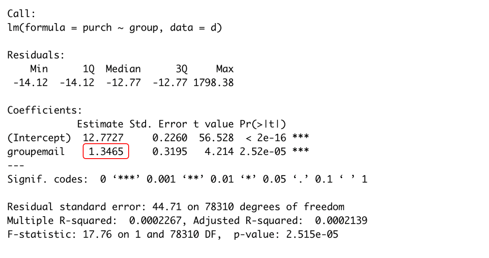
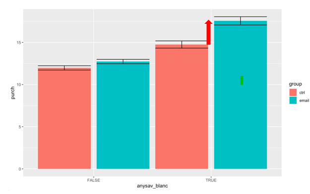
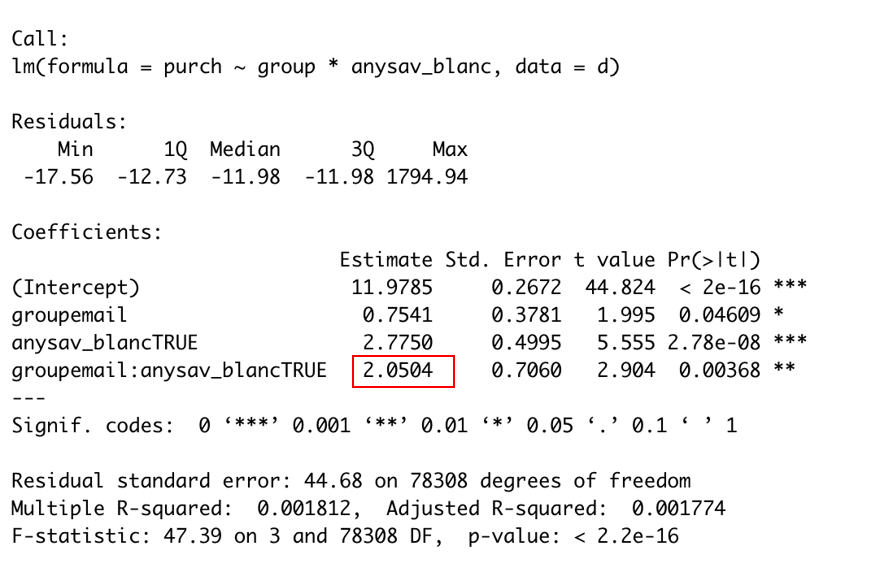
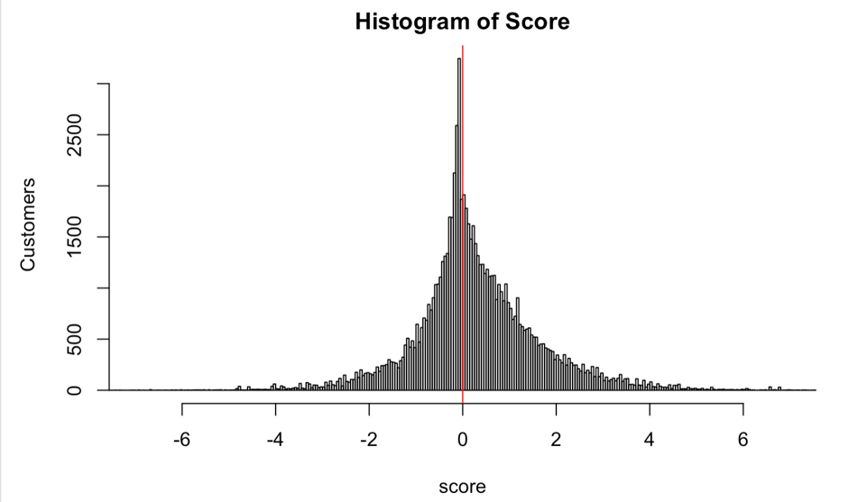

# Customer Targeting for Email Promotion

## Overview
In this experiment we were examining the impact of an email that was intended to drive
purchases. We want you to evaluate whether the promotion is effective and who to target
with the email campaign.
### Method
#### Effectiveness Evaluation
- Average Casual Effect

  - Customers generally spend $1.34 more with email promotion campaign.

  - Baseline variable selection
    - Add other variables as baseline variables
    - Compare standard errors

- Slicing and Dicing Analysis

  - Our email campaign works the most effectively on customers who have purchased sav blanc

  - Sav blanc buyers are more affected by the email, leading to addition $2.05 in spending

#### Targeting/Prediction Methods
- Uplift model
- Casual Forest model
- Customer Scoring (Score = 𝛕i|X *profit margin - unit cost)

  - Targeted group characteristics
      - Visit website less than 10 times
      - Half of them are recent buyers(last purchase day < 60)
      - Half of them have purchased wine with value less than $50

  - Targeting would increase profit by reducing cost

### Final Suggestion
Our email campaign is effective and we should target at customer with score>0
